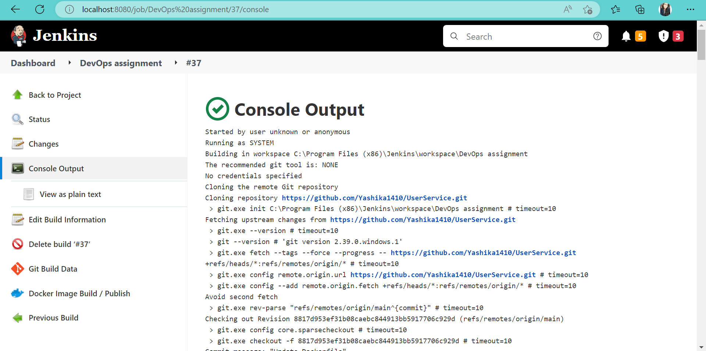
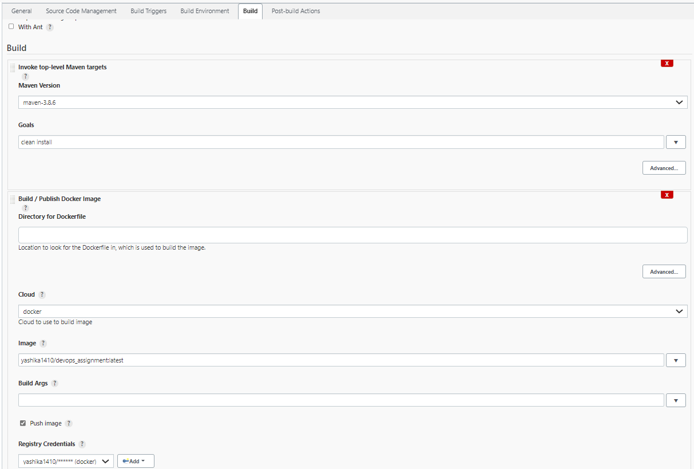

# User Service DevOps Assignment

#

## CI CD ScreenShot's
###  Project Dashboard

### Build Job Dashboard

### Console Output ([output.txt](./output.txt))

### Project Configuration

* Source Code Management

* Build Action Steps

* Post Build Action Steps

